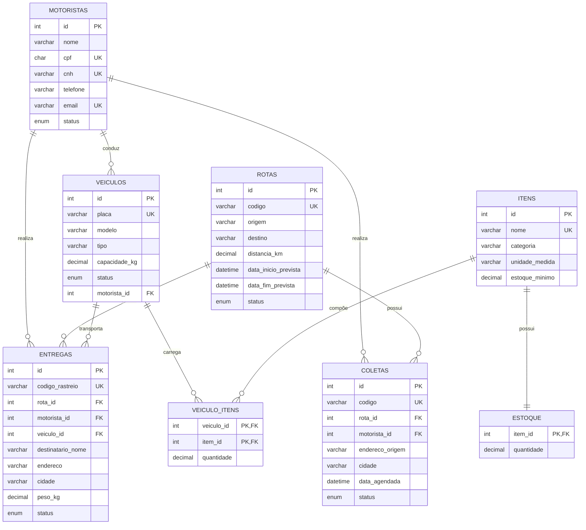

# DER — LogiTech Express

Modelo lógico proposto para eliminar os principais problemas descritos no enunciado: motoristas duplicados e itens/ferramentas armazenados como texto separado por vírgulas.

## Normalização aplicada

**1FN:** não há listas em uma coluna. Itens de frota foram separados em `itens` e na tabela associativa `veiculo_itens`.

**2FN:** atributos dependem da chave da própria entidade. A descrição do item não é repetida em cada veículo.

**3FN:** informações de motorista, veículo, rota e item estão em suas próprias tabelas; as relações usam chaves estrangeiras.
